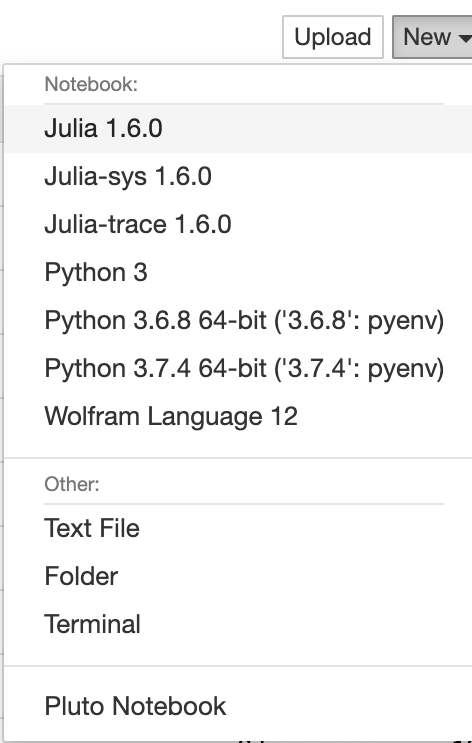
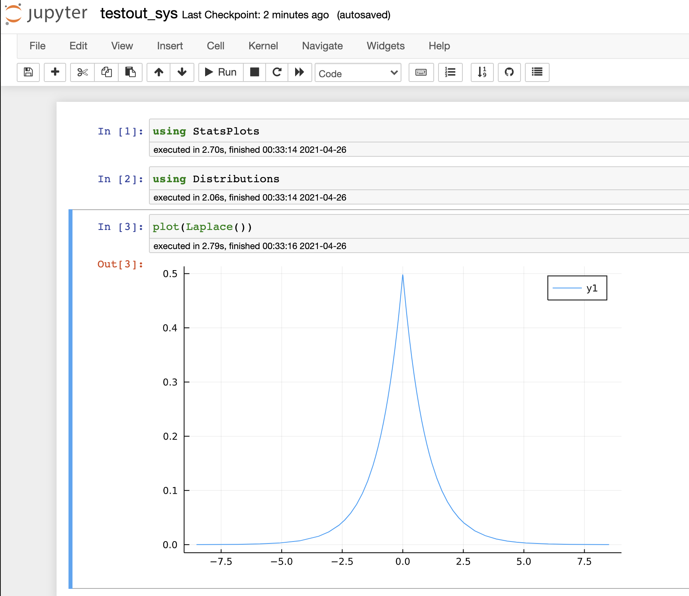
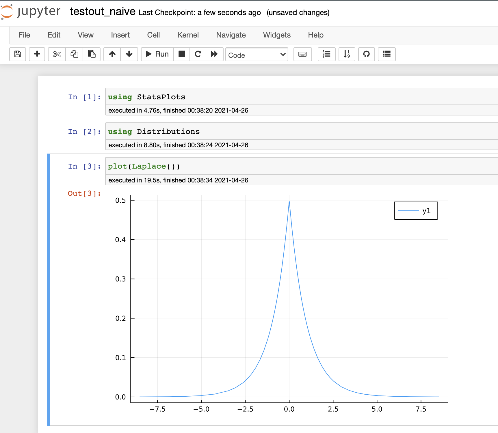

f(x) = sin(x)
x = pi
f(x)
f（x）

# sysimage_creator

[](https://github.com/terasakisatoshi/sysimage_creator/actions/workflows/CI.yml)

- This repository aims to provide scripts that create sysimage that accelerates initialization of IJulia kernel.
- It also will reduce latency when working locally with packages that has a high startup time e.g. Plots.jl or StatsPlots.jl .

# Usage: For 今北産業(TL;DR) users

```console
$ git clone https://github.com/terasakisatoshi/sysimage_creator.git
$ pip install jupyter jupytext nbconvert ipykernel
$ cd sysimage_creator && make && jupyter notebook
```

Then open your jupyter notebook and select a kernel named `Julia-sys 1.6.3`

# Usage: For reasonable people

## Step 1: Install dependencies

- Almost people can skip this step because your are trying to improve your Jupyter IJulia.jl, to You know what to do.
- Install [Julia](https://julialang.org/downloads/) and Python
- Let's install `jupyter` (or `jupyterlab` instead) and `jupytext` via:
```console
$ pip install jupyter jupytext
$ pip install nbconvert ipykernel # I'm not sure, but you may need on Windows.
```

- After that, let's moving on to Step2!!!

### Step1-1: Help! I'm new to any kind of programming language.

- All right. Welcome to Julia! First of all please [install Julia from here](https://julialang.org/downloads/). Please see platform specific instructions for further installation instructions and if you have trouble installing Julia. You'll learn how to add a path of a program for Julia. Open your terminal and type `julia` command.

```console
$ julia
               _
   _       _ _(_)_     |  Documentation: https://docs.julialang.org
  (_)     | (_) (_)    |
   _ _   _| |_  __ _   |  Type "?" for help, "]?" for Pkg help.
  | | | | | | |/ _` |  |
  | | |_| | | | (_| |  |  Version 1.6.3 (2021-09-23)
 _/ |\__'_|_|_|\__'_|  |  Official https://julialang.org/ release
|__/                   |

julia> # congrats!
julia> exit() # exit from julia REPL
$ julia # you can start again.
```

- Moving on to the next step. Let's install PyCall and IJulia and then your environment can initialize jupyter notebook

```conosle
julia> ENV["PYTHON"]=""; ENV["JUPYTER"]=""
julia> using Pkg; Pkg.add(["PyCall", "IJulia", "Conda"])
julia> using Conda; Conda.add(["jupyter", "jupytext"], channel="conda-forge")
```

- Tips: you don't have to copy code above line by line. Copy the whole 3 lines. Don't hesitate to include prompt `julia>`. Then just do paste to your julia REPL.
- Tips: Setting `ENV["PYTHON"]=""; ENV["JUPYTER"]=""` makes julia select Python provided via [Conad.jl](https://github.com/JuliaPy/Conda.jl). Conda.jl uses the miniconda Python environment, which only includes conda and its dependencies. If you have LITTLE experience with Python, just follow the instructions above is fine.
- Tips: Ah, you've remembered you can use Python and Jupyter from your terminal e.g.

```console
$ python
>>>
```

```console
$ pip install numpy
```
or whatever

```console
$ jupyter notebook
```

If so, you may consider do the following command:

```julia
julia> run(`pip install jupyter jupytext nbconvert ipykernel`)
julia> ENV["PYTHON"]=Sys.which("python3"); ENV["JUPYTER"]=Sys.which("jupyter")
julia> using Pkg; Pkg.build(["PyCall", "IJulia"])
```

What does it do? Well, read the code: [deps/build.jl](https://github.com/JuliaLang/IJulia.jl/blob/master/deps/build.jl).

Anyway, after finished the installation, let's initialize Juptyer notebook:

```julia
julia> using IJulia; notebook(dir=pwd())
```

## Step 2: Create sysimage

- Ah... also make sure you can use `$ make` command in your terminal.
- Just run `make`. It will make sysimage named `sys.{DLEXT}`, where `DLEXT` is `dylib, dll or so`.

```
$ make
...
...
...
$ ls
sys.dylib # e.g. macOS users
```

## Testout sysimage

### Case 1: from terminal

- You can feel how much time we can reduce latency when we use our sysimage:

```
$ cat benchmark.jl
# use standard julia
@time run(`jupytext --to ipynb --execute testout_naive.jl`)
# use sys.${DLEXT} as sysimage
@time run(`jupytext --to ipynb --execute testout_sys.jl`)
$ julia --project=@. benchmark.jl
```

or just run `make test` :D.

### Case 2: from jupyter

- Open Jupyter Notebook as always:

```
$ jupyter notebook
```

- Then you'll see New kernel for Julia named `Julia-sys 1.6.3`.



- Please select it. This kernel is generated by `installkernel.jl` which is stored in this repository.

```console
$ cat ~/Library/Jupyter/kernels/julia-sys-1.6/kernel.json
{
  "display_name": "Julia-sys 1.6.3",
  "argv": [
    "/Applications/Julia-1.6.app/Contents/Resources/julia/bin/julia",
    "-i",
    "--color=yes",
    "--project=@.",
    "--sysimage=sys", # <--- this `sys` is a name of sysimage
    "/Users/<your-user-name>/.julia/packages/IJulia/e8kqU/src/kernel.jl",
    "{connection_file}"
  ],
  "language": "julia",
  "env": {},
  "interrupt_mode": "signal"
}
```

- If you click `testout_sys.jl` file, Jupyter recognize this file as notebook, and initialize it with option `--sysimage=sys`.
- Here is a result of running `testout_sys.jl` using our sysimage:



- Here is a result of running `testout_naive.jl` using standard sysimage, which is so slow:



